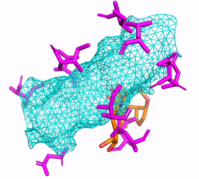

# DiffDock-Pocket: Diffusion for Pocket-Level Docking with Side Chain Flexibility
[](https://github.com/plainerman/DiffDock-Pocket)
[](https://huggingface.co/spaces/reginabarzilaygroup/DiffDock-Pocket-Web)
[](LICENSE)
[](CODE_OF_CONDUCT.md)

DiffDock-Pocket is an all-atom docking model operating on the pocket level. It implements diffusion over side chain torsion angles and is optimized for computationally generated structures. In this repository, you will find the code to train a model, run inference, visualizations, and the weights we used to achieve the numbers presented in the paper. 
This repository is originally a fork from DiffDock, so some of the commands may seem familiar - but it has been extended, adapted and changed in so many places that you cannot expect any compatability of the two programs. Be aware, and do NOT mix up these two programs!

If you want an easy way to run inference, you can use the HuggingFace interface [here](https://huggingface.co/spaces/reginabarzilaygroup/DiffDock-Pocket-Web).

Feel free to create any issues, or PRs if you have any problems with this repository! Please consider the [code of conduct](CODE_OF_CONDUCT.md).




## Setup the conda environment
You can either create the CPU or CUDA conda environment by simply running
```
conda env create -f environment[-cpu].yml
```
with, or without the cpu flag. The CUDA version is recommended, as it is much faster.

## Running DiffDock-Pocket on custom complexes
In this minimal example, we use the complex `3dpf` and re-dock the ligand with flexible side cahins.
We draw 40 samples, and rank them with the confidence model. All predictions will be stored in `results/`. 

    python inference.py --protein_path example_data/3dpf_protein.pdb --ligand example_data/3dpf_ligand.sdf --batch_size 20 --samples_per_complex 40 --keep_local_structures --save_visualisation

Here, we specified the `--keep_local_structures` flag to not modify the ligand. 
With this, the pocket and which side chains to model flexible is automatically determined.

If this command runs out of memory, you can decrease the `--batch_size` or the `--samples_per_complex` parameter.
Lowering `--batch_size` will not impact the quality of the results, but will increase the runtime.

A similar command for computationally generated structures would be:

    python inference.py --protein_path example_data/3dpf_protein_esm.pdb --ligand example_data/3dpf_ligand.sdf --batch_size 20 --samples_per_complex 40 --keep_local_structures --save_visualisation

To perform energy minimization on the top-1 predicted ligand pose, you can use the `--relax` flag.

If you know your binding pocket and which side chains to model as flexible, you can specify them.
In this case, you can also drop `--keep_local_structures`.
We advise using our provided model only with flexible amino acids that have at least one heavy atom within 3.5A of any heavy ligand atom.
This prevents out-of-distribution data.

    python inference.py --protein_path example_data/3dpf_protein.pdb --ligand example_data/3dpf_ligand.sdf --batch_size 20 --samples_per_complex 40 --save_visualisation --pocket_center_x 9.7742 --pocket_center_y 27.2863 --pocket_center_z 14.6573 --flexible_sidechains A:160-A:193-A:197-A:198-A:222-A:224-A:227

Or if you do not have a ligand at hand, you can also use the SMILES representation. 

    --ligand [H]/N=C1/C(=O)C(=O)[C@@]1([H])[N@@+]1([H])C([H])([H])c2c([H])c(C([H])([H])N([H])C(=O)c3nc4sc5c(c4c(=O)n3[H])C([H])([H])C([H])([H])S(=O)(=O)C5([H])[H])c([H])c([H])c2C([H])([H])C1([H])[H]

However, in this case you have to specify your pocket center and flexible side chains.

If you are dealing with multiple complexes, take a look at `data/protein_ligand_example_csv` with the flag`--protein_ligand_csv data/protein_ligand_example_csv.csv`.
This allows you to specify inference on multiple complexes at once, where you can specify the pocket center and flexible side chains for each complex.

## Choosing the pocket center
When choosing the pocket center, it is best to determine the amino acids that are close to the binding site and compute the mean of their C-alpha coordinates.
In our training, we have chosen all amino acids where their C-alpha atom is within 5A of any heavy atom of the ligand.

# Training a model
## Dataset
We are using PDBBind which you can download from many sources.
However, we also provide a pre-processed PDBBind dataset [here](https://github.com/plainerman/DiffDock-Pocket/releases/tag/v1.0.0) which you can unpack with `unzip`.
All proteins have been fixed with [PDBFixer](https://github.com/openmm/pdbfixer) and aligned to minimize the RMSD in the pocket.
Unpack it to `data/PDBBIND_atomCorrected`.

## Training the score model
Train the large score model:

    python -m train --run_name big_score_model --test_sigma_intervals --log_dir workdir --lr 1e-3 --tr_sigma_min 0.1 --tr_sigma_max 5 --rot_sigma_min 0.03 --rot_sigma_max 1.55 --tor_sigma_min 0.03 --sidechain_tor_sigma_min 0.03 --batch_size 16 --ns 60 --nv 10 --num_conv_layers 6 --distance_embed_dim 64 --cross_distance_embed_dim 64 --sigma_embed_dim 64 --dynamic_max_cross --scheduler plateau --scale_by_sigma --dropout 0.1 --sampling_alpha 1 --sampling_beta 1 --remove_hs --c_alpha_max_neighbors 24 --atom_max_neighbors 8 --receptor_radius 15 --num_dataloader_workers 1 --cudnn_benchmark --rot_alpha 1 --rot_beta 1 --tor_alpha 1 --tor_beta 1 --val_inference_freq 5 --use_ema --scheduler_patience 30 --n_epochs 750 --all_atom --sh_lmax 1 --split_train data/splits/timesplit_no_lig_overlap_train --split_val data/splits/timesplit_no_lig_overlap_val_aligned --pocket_reduction --pocket_buffer 10 --flexible_sidechains --flexdist 3.5 --flexdist_distance_metric prism --protein_file protein_esmfold_aligned_tr_fix --compare_true_protein --conformer_match_sidechains --conformer_match_score exp --match_max_rmsd 2 --use_original_conformer_fallback --use_original_conformer

The model weights are saved in the `workdir` directory and can be used for inference. 

## Training the confidence model
To train the confidence model, you could use the previously trained score model to generate the samples.
However, we opted to train another (smaller) score model with a higher maximum ligand translation, so that the confidence model sees more diverse samples and the training data can be produced more quickly.

To train this smaller score model with higher maximum translation, run the following:

    python -m train --run_name small_score_model --test_sigma_intervals --esm_embeddings_path data/esm2_3billion_embeddings.pt --cache_path data/cache --log_dir workdir --lr 1e-3 --tr_sigma_min 0.1 --tr_sigma_max 15 --rot_sigma_min 0.03 --rot_sigma_max 1.55 --tor_sigma_min 0.03 --sidechain_tor_sigma_min 0.03 --batch_size 16 --ns 32 --nv 6 --num_conv_layers 5 --dynamic_max_cross --scheduler plateau --scale_by_sigma --dropout 0.1 --sampling_alpha 1 --sampling_beta 1 --remove_hs --c_alpha_max_neighbors 24 --atom_max_neighbors 12 --receptor_radius 15 --num_dataloader_workers 1 --cudnn_benchmark --rot_alpha 1 --rot_beta 1 --tor_alpha 1 --tor_beta 1 --val_inference_freq 5 --use_ema --scheduler_patience 30 --n_epochs 500 --all_atom --sh_lmax 1 --split_train data/splits/timesplit_no_lig_overlap_train --split_val data/splits/timesplit_no_lig_overlap_val_aligned --pocket_reduction --pocket_buffer 10 --flexible_sidechains --flexdist 3.5 --flexdist_distance_metric prism --protein_file protein_esmfold_aligned_tr_fix --compare_true_protein --conformer_match_sidechains --conformer_match_score exp --match_max_rmsd 2 --use_original_conformer_fallback --use_original_conformer

The score model used to generate the samples to train the confidence model does not have to be the same as the score model that is used with that confidence model during inference.

Train the confidence model by running the following:

    python -m filtering.filtering_train --run_name confidence_model --original_model_dir workdir/small_score_model --ckpt best_ema_inference_epoch_model.pt --inference_steps 20 --samples_per_complex 7 --batch_size 16 --n_epochs 100 --lr 3e-4 --scheduler_patience 50 --ns 24 --nv 6 --num_conv_layers 5 --dynamic_max_cross --scale_by_sigma --dropout 0.1 --all_atoms --sh_lmax 1 --split_train data/splits/timesplit_no_lig_overlap_train --split_val data/splits/timesplit_no_lig_overlap_val_aligned --log_dir workdir --cache_path .cache/data_filtering data/PDBBIND_atomCorrected --remove_hs --c_alpha_max_neighbors 24 --receptor_radius 15 --esm_embeddings_path data/esm2_3billion_embeddings.pt --main_metric loss --main_metric_goal min --best_model_save_frequency 5 --rmsd_classification_cutoff 2 --sc_rmsd_classification_cutoff 1 --protein_file protein_esmfold_aligned_tr_fix --use_original_model_cache --pocket_reduction --pocket_buffer 10 --cache_creation_id 1 --cache_ids_to_combine 1 2 3 4


first with `--cache_creation_id 1` then `--cache_creation_id 2` etc. up to 4

Now everything is trained and you can run inference with your new model :).

# Citation

If you use DiffDock-Pocket in your research, please cite the following paper:
```
@article{plainer2023diffdockpocket,
  author = {Plainer, Michael and Toth, Marcella and Dobers, Simon and St{\"a}rk, Hannes and Corso, Gabriele and Marquet, C{\'e}line and Barzilay, Regina},
  title = {{DiffDock-Pocket}: Diffusion for Pocket-Level Docking with Sidechain Flexibility},
  year = {2023},
  maintitle = {Advances in Neural Information Processing Systems},
  booktitle = {Machine Learning in Structural Biology},
}
```

# Acknowledgements

Thank you [@jsilter](https://github.com/jsilter) for making this code easier to use and for creating the HuggingFace interface!
